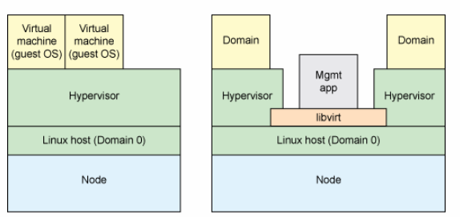
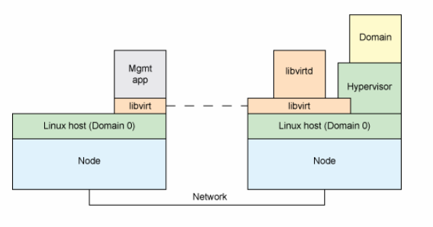

# 概念
> 1. 云计算时代，libvirt成为横向扩展最重要的库之一   
> 2. libvirt 提供一种虚拟机监控程序不可知的 API 来安全管理运行于主机上的来宾操作系统   
> 3. libvirt 本身 不是一种工具， 它是一种可以建立工具来管理来宾操作系统的 API   
> 4. libvirt 本身构建于一种抽象的概念之上。它为受支持的虚拟机监控程序实现的常用功能提供通用的 API   
> 5. libvirt 起初是专门为 Xen 设计的一种管理 API，后来被扩展为可支持多个虚拟机监控程序
>> 1. KVM
>> 2. Xen
>> 3. VMware
>> 4. QEMU
>> 5. VirtualBox
>> 6. OTHERS

# 基本架构
> 1. 首先让我们从用例模型视角来展开对 libvirt 的讨论，然后深入探究其架构和用途。libvirt 以一组 API 的形式存在，旨在供管理应用程序使用(如下图1)。libvirt 通过一种特定于虚拟机监控程序的机制与每个有效虚拟机监控程序进行通信，以完成 API 请求。文章后面我将探讨如何通过 QEMU 来实现该功能。   
图 1. libvirt 比较和用例模型   

> 2. 图中还显示了 libvirt 所用术语对照。这些术语很重要，因为在对 API 命名时会用到它们。两个根本区别在于，libvirt 将物理主机称作节点，将来宾操作系统称作域。这里需要注意的是，libvirt（及其应用程序）在宿主 Linux 操作系统（域 0）中运行。   

## 控制方式
> 1. 使用 libvirt，我们有两种不同的控制方式。第一种如 图 1 所示，其中管理应用程序和域位于同一节点上。 在本例中，管理应用程序通过 libvirt 工作，以控制本地域。当管理应用程序和域位于不同节点上时，便产生了另一种控制方式。在本例中需要进行远程通信（参见 图 2）。   
> 2. 该模式使用一种运行于远程节点上、名为 libvirtd 的特殊守护进程。当在新节点上安装 libvirt 时该程序会自动启动，且可自动确定本地虚拟机监控程序并为其安装驱动程序（稍后讨论）。   
> 3. 该管理应用程序通过一种通用协议从本地 libvirt 连接到远程 libvirtd。对于 QEMU，协议在 QEMU 监视器处结束。QEMU 包含一个监测控制台，它允许检查运行中的来宾操作系统并控制虚拟机（VM）各部分。   
图 2. 使用 libvirtd 控制远程虚拟机监控程序    

## 虚拟机监控程序支持
> 1. 为支持各种虚拟机监控程序的可扩展性，libvirt 实施一种基于驱动程序的架构，该架构允许一种通用的 API 以通用方式为大量潜在的虚拟机监控程序提供服务。这意味着，一些虚拟机监控程序的某些专业功能在 API 中不可见。   
> 2. 另外，有些虚拟机监控程序可能不能实施所有 API 功能，因而在特定驱动程序内被定义为不受支持。图 3 展示了 libvirt API 与相关驱动程序的层次结构。这里也需要注意，libvirtd 提供从远程应用程序访问本地域的方式。    
图 3. 基于驱动程序的 libvirt 架构     

