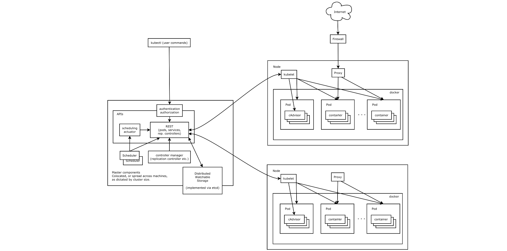

# 前世今生
## Borg 简介
> Borg 是谷歌内部的大规模集群管理系统，负责对谷歌内部很多核心服务的调度和管理。Borg 的目的是让用户能够不必操心资源管理的问题，让他们专注于自己的核心业务，并且做到跨多个数据中心的资源利用率最大化。   
> Borg 主要由 BorgMaster、Borglet、borgcfg 和 Scheduler 组成，如下图所示   

> > 1、BorgMaster 是整个集群的大脑，负责维护整个集群的状态，并将数据持久化到 Paxos 存储中；   
> > 2、Scheduer 负责任务的调度，根据应用的特点将其调度到具体的机器上去；   
> > 3、Borglet 负责真正运行任务（在容器中）；   
> > 4、borgcfg 是 Borg 的命令行工具，用于跟 Borg 系统交互，一般通过一个配置文件来提交任务。   

## Kubernetes 架构
> Kubernetes 借鉴了 Borg 的设计理念，比如 Pod、Service、Labels 和单 Pod 单 IP 等。Kubernetes 的整体架构跟 Borg 非常像，如下图所示   

